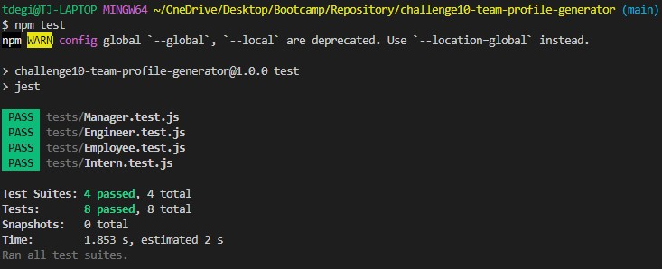

# challenge10-team-profile-generator

  ## Table of Contents
  - [Description](#description)
  - [Installation](#install)
  - [Usage](#usage)
  - [Testing](#tests)
  - [Questions](#questions)

  
  ## Description
    This assignment is to build a team profile using a combination of tools learned so far. The inquirer package is used to accept command line user input, then an HTML page is generated using javascript. TDD was also utilized in order to create and pass assigned tests.

  
  ## Installation 
  npm i

  
  ## Usage 
  inquirer package required
  jest required

  View Video Walkthrough at the link below:
  https://drive.google.com/file/d/1GKi72M2XICLUHY1X-RTy5NeFneGu6lOl/view
  
  
  ## Testing
  npm test is used and passed tests are shown below:
  

  
  ## Questions 
  - Github: [tdegirol](https://github.com/tdegirol)
  - Email: tdegirol@github.com
